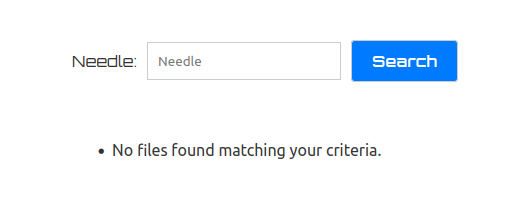
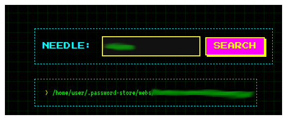
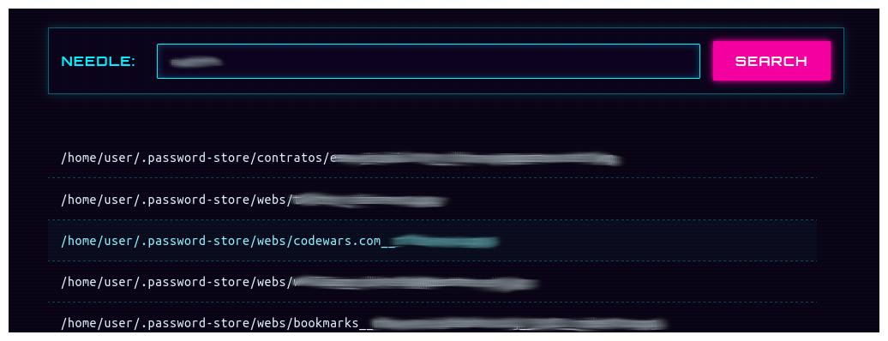

# WebPass - A Web Interface for pass (Password Store)

**WebPass** is a modern and user-friendly web interface for [pass](https://www.passwordstore.org/), the standard Unix password manager. It combines a React frontend with a FastAPI backend to provide secure and convenient access to your password store from the browser.


(default theme)

> ⚠️ This project is a work in progress and is provided as-is. Use at your own risk. I am not responsible for any damage or data loss caused by the usage of this application.

## 🔐 Focus on Security

WebPass prioritizes security at every step:

- **JWT (JSON Web Tokens)** for user authentication and session management.
- **GPG** integration to maintain full compatibility with `pass`.

## 🎨 Extensible and Themed

WebPass is designed to be easily extensible:

- Add new **themes** with minimal effort to match your personal style or organization branding.
- Built with modularity in mind, allowing future enhancements or custom features.


(retro theme)

(cyberpunk theme)

* You can select the desired theme on frontend/.dev and rebuild frontend container.

## 📁 Host Requirements

Before running WebPass, ensure the following are properly set up on the host machine:

- A cloned repository of your personal `pass` store (e.g., `~/.password-store`).
- The corresponding **GPG keys** must already be available.
- The `docker-compose` service mounts these directories **as read-only**, meaning your data remains untouched and secure by design.

These requirements are critical for WebPass to function correctly, as it relies on the host’s `pass` and GPG environment to operate securely.

## 🚀 Quick Start

### Prerequisites

- `curl`
- `bash`
- `docker` and `docker-compose`

### Installation & Run

```bash
curl -sSL https://raw.githubusercontent.com/rrbarrero/pass-web/main/ops/install.sh | bash
```

🧪 Development Status
This project is under active development. Expect rapid iterations, breaking changes, and new features. Contributions and feedback are welcome!

📄 Disclaimer
This software is provided without any warranty. You are solely responsible for how you use it. Make sure you understand the implications of exposing password management to a web interface.
